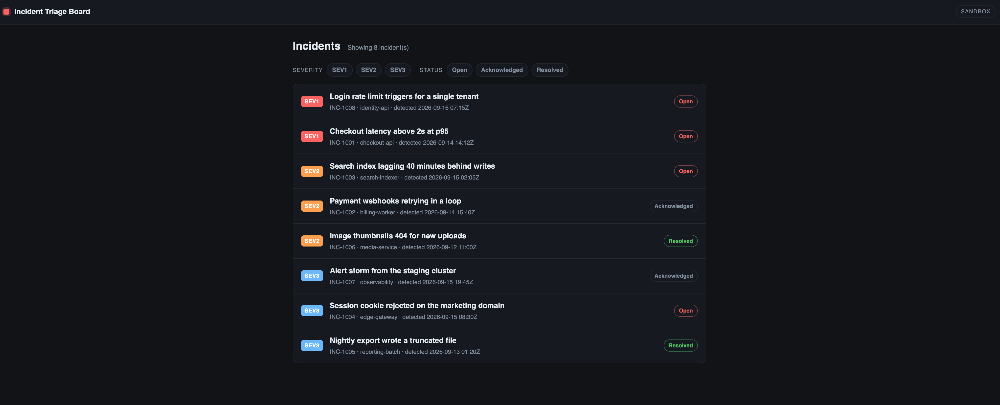

# 1. Let an agent build inside a sandbox

Our first step is to give one coding agent a place to work. We will launch Claude
Code in SBX, sign in, and ask it to run and change the sample application. The app's
source directory is shared with your laptop, so you can see its edits on the host.
Commands and the database container run inside the sandbox. You will explore that
boundary yourself before trusting an agent with a larger task.

## 1. Start Claude in your application

From the workshop repository root:

```bash
# HOST
sbx run claude "$(pwd)/sample-app" --name wad-manual --skills off --cpus 4 --memory 8g
```

`claude` chooses the agent, `"$(pwd)/sample-app"` gives the full path to the sample
application to share, and `--name` gives the environment a reusable name. `--skills off` keeps the exercise
independent of host-installed skills; the final options give it four CPUs and 8 GB.
This creates the sandbox and opens Claude Code in your app directory. Keep this
terminal open while working. If you repeat this exercise, choose a fresh sandbox
name to create a new environment with these settings.

**Sign in:** if Claude asks you to authenticate, choose your subscription account
and follow the browser login. You can also type `/login` inside Claude. Existing
SBX credentials may mean you are already authenticated. See
[Claude authentication in SBX](https://docs.docker.com/ai/sandboxes/agents/claude-code/).

The built-in Claude configuration starts with permission prompts bypassed—the
“YOLO” mode for this exercise. SBX still enforces its own access boundaries.

## 2. Try shell commands without leaving Claude

Claude's [`!` shell mode](https://code.claude.com/docs/en/interactive-mode#shell-mode-with--prefix)
runs a command directly. Enter these one at a time **in Claude's input**, not in your
host shell:

```text
!pwd
!whoami
!docker version
```

You are in the application directory, running as the sandbox user. Docker's server
is inside SBX; you do not need a host Docker engine.

We want to see which files are shared with the sandbox. In a **second host
terminal**, create a file outside the sample application:

```bash
# HOST — from the workshop repository
printf 'A note outside the shared app.\n' > host-only.txt
```

Only `sample-app/` is mounted. Predict whether Claude can read this neighbouring
file, then enter these commands in **Claude's input** in the first terminal:

```text
!printf 'Hello from SBX\n' > sandbox-message.txt
!cat ../host-only.txt
```

The first command writes into the shared application directory. The second should
fail: you created that file outside the directory you mounted.

Back in your **second host terminal**:

```bash
# HOST
cat "./sample-app/sandbox-message.txt"
cat "./host-only.txt"
```

You can read both on the host. Edits inside the mounted app are bidirectional;
unrelated host directories have not been shared. The same applies to deletions
inside the mounted directory. Remove the demonstration file from Claude:

```text
!rm sandbox-message.txt
```

## 3. Ask the agent to run the app

Give Claude this prompt:

> Read README.md and get this application running inside the sandbox. Install its
> dependencies, start its PostgreSQL Docker container, migrate and seed the database,
> and start the web server on 0.0.0.0:8080 as a background process. Verify /healthz
> responds successfully. Do not change the application yet. Tell me when it is ready.

Watch the commands it chooses. This is the value of giving the agent a real working
environment: it can install dependencies and start the containers it needs.
If it asks where to run something, all app commands belong inside this sandbox.

When it reports the app is ready, ask to see its health response. In Claude:

```text
!curl -fsS http://127.0.0.1:8080/healthz
```

This requests the application's health endpoint from inside SBX. Look for an OK
status and the database being up. If it fails, ask Claude to finish startup before
continuing. This checks local health; the server must also listen on `0.0.0.0`, as
requested above, so the published port can reach it.

Then publish the web port from your second host terminal:

```bash
# HOST
sbx ports wad-manual --publish 3101:8080
```

`3101:8080` connects port 3101 on your host to port 8080 in this sandbox.
Open **<http://127.0.0.1:3101>**. You should see the incident list and severity/status
filters. This is our starting application:



The browser runs on your host; the application and PostgreSQL run in SBX. The
published port connects them. If the page does not load, ask Claude to check the
server and `/healthz` before changing anything on the host.

## 4. Give the agent its first change

Our first demo task is a small change to the sample application: make its result
count follow the active filter. This is the warm-up exercise referred to in later
chapters. Try a severity or status filter, then give Claude this prompt:

> Read WORKSHOP-TASK.md and implement the active-filter result-count task. Run the
> relevant checks inside this sandbox, commit your change, and refresh the running
> app so I can try it. Use “Workshop learner” and “workshop@example.invalid” as the
> Git author if none is configured. Do not install a browser or run the browser-test
> suite for this exercise. Report what changed and the commit.

Try the filters again in your browser. Ask Claude to show the commit and explain
what it checked. You can inspect it yourself without leaving Claude:

```text
!git status --short
!git log -1 --oneline
```

The change is **already on your host** in `sample-app/`. There is no `sbx cp` step because
this working directory is mounted. The next chapter uses that committed source.

When done, exit Claude and stop this sandbox from the host:

```bash
# HOST
sbx stop wad-manual
```

**Result:** an agent ran the app and its database inside SBX, changed the code, and
left the result in your working directory. Next we make launching a task repeatable.

## Skip to the completed chapter

To skip to the completed exercise, stop `wad-manual` if it is running. Then run
this from the workshop repository:

```bash
./scripts/prepare-app.sh app-01-warmup-solution
```

This puts the supplied completed exercise in `sample-app/`. Your previous copy is
saved under `.local/saved-app.*`; the command prints its location. Continue with
chapter 02 using the same `sample-app/` path.

Next: [environment files and the host launcher](../02-launcher/README.md).
