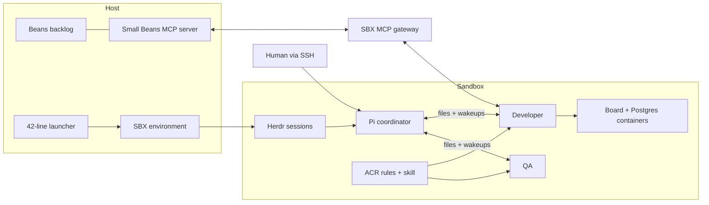

# From one agent to a software factory

Start with an assistant you can let act. Finish with a team you can give work.
The same incident triage board supplies the UI, API and PostgreSQL workload throughout.
Docker's components are the lesson; the small host script is plumbing.

Start with [chapter 00](00-setup/README.md), then follow each chapter's README
from the top. Each explains the goal, the new concept, the commands to get there,
and the result to observe. Host and sandbox commands are labelled.

The numbered directories are **completed infrastructure reference assemblies**.
The walkthrough builds editable `chapters/my-*` recipes incrementally from the
previous chapter. Use a reference directory's `./launch` to catch up, rather than
as a substitute for the construction exercise. Application fixtures are supplied
checkpoints, not fabricated agent output. Carrying your own app forward is explicit.

[Presenter-only cloud and mounts](08-presenter/README.md)

| Directory | The new capability | What you can point to afterward |
|---|---|---|
| [00-setup](00-setup) | Install and authenticate | Standalone SBX, tools, dedicated host backlog |
| [01-agent](01-agent) | Let one agent act in SBX | Isolated files, Docker inside SBX, board in your browser |
| [02-launcher](02-launcher) | Launch work from Beans + sbxenv | Task snapshot and app delivered by a 42-line launcher |
| [02.5-acr](02.5-acr) | First kit: distribute guidance | Four coding rules and a review skill materialized by ACR |
| [03-pi](03-pi) | Add another assistant with a kit | Pi reads the same policy; role/provider choices are explicit |
| [04-team](04-team) | Add Herdr with another kit | Coordinator → developer → QA, using files plus wakeups |
| [05-mcp](05-mcp) | Bridge to the host through MCP | Team fetches a real Bean and appends its result note |
| [06-human](06-human) | Intervene through SSH | A recorded human decision resumes the same team |
| [07-factory](07-factory) | Give the factory another task | Changed app, review, task note and retrievable source |

## Run a completed reference chapter (catch-up)

From its directory, run `./launch`, then leave that terminal open and follow its README in a second host terminal. Setup is shared; recipes
are separate. The launcher uses no workspace mounts. It transfers a pinned app fixture
and supplied support into `~/work` in the sandbox. The Beans directory stays on the host.
`./launch another-name` gives you a fresh sandbox without overwriting your previous run.
Use `WORKSHOP_PORT=3200 ./launch another-name` if the normal port is occupied.

Chapter 1 mounts `$WARMUP`: its changes are already on the host. Later factory
chapters use isolated source snapshots. To carry one of those results forward,
retrieve the sandbox's app with
`sbx cp NAME:/home/agent/work/app ./saved-app`, then launch the next chapter with
`./launch new-name /absolute/path/to/saved-app`.
This transfers committed source only. Commit inside SBX before copying. Don't execute
agent-generated application code on the host.

The host launcher does not supervise, verify, merge or close tasks. Agents test and
review inside SBX, refresh the board and write a result note. Independent acceptance
is a possible extension, not a workshop prerequisite.

## Rehearsal and session pacing

Allocate 10 minutes for installation/orientation; 15 for SBX; 11 for the launcher;
7 for ACR; 11 for Pi; 13 for Herdr; 15 for MCP/controls; 13 for SSH/results. Protect
minutes 95–120 for catch-up, experimentation and presenter cloud/governance extensions.
These are targets, not measured timings. Do not build every full feature anew: the
Herdr chapter proves a handoff; the MCP chapter starts the main feature. It may continue
while you inspect controls. Chapter 06 is a separate prepared starting point when a
predictable decision exercise is needed.

## What's deliberately supplied

`support/launch` is the whole host runtime path. Setup reuses downloaders and the
prebuilt MCP adapter. `support/bin` starts the app and Herdr sessions inside SBX;
`support/roles` contains short role briefs. The existing tested file transport and
wake-up helper are copied from `support/bin`. Read them if interested; attendees
do not implement a delivery protocol during the workshop.

Development tests, acceptance machinery and historical reports live in the original
working repository. This workshop edition contains only the teaching path and its
runtime dependencies. Download the versioned materials as described in chapter 00.

## Keep one SBX session open

The tested SBX build auto-stops a sandbox 30 seconds after its last client session
disconnects, even if background processes are running inside. `launch` therefore
ends with one foreground `sbx exec NAME sleep infinity`. Leave that host terminal
open; use another terminal for the exercises. It is a session hold, not a workflow
supervisor. Ctrl-C releases it. A stopped sandbox preserves files but loses live
agent processes. Retrieve work before stopping; use a fresh named launch for rehearsal.
